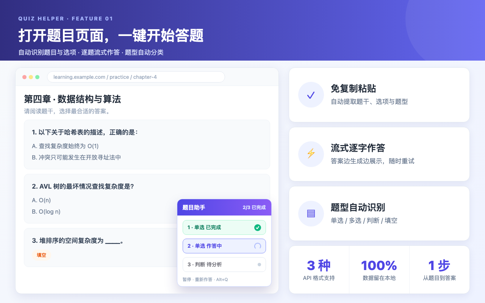

# 题目助手（Quiz Helper）

**中文** | [English](./README.en.md)

  

一个面向在线题目场景的浏览器插件。

它可以从当前页面提取题目内容，调用用户自行配置的大模型接口生成参考答案，并支持题库匹配、AI 选区解析和联网搜索增强。

  
  
  
  
  
  
  
  

## 核心功能

- 页面题目提取：从当前网页中识别并提取题目、选项和题型
- AI 参考答案：调用用户配置的大模型接口生成逐题参考答案
- 流式输出控制：可在设置页全局开关大模型测试与答题的流式返回
- AI 选区解析：手动选择页面区域，让 AI 解析局部题目内容
- 题库导入与匹配：支持导入题库，并在答题时优先进行题库匹配
- 联网搜索增强：在需要时结合搜索结果辅助生成答案
- 历史记录管理：保存本地分析记录，支持查看、导出和清理
- 备份与恢复：支持按模块导出/导入本地配置与数据
- 主题与快捷键：支持深浅色主题与面板快捷键配置
- 中英双语适配：界面文案与 AI 提示词随浏览器界面语言自动切换中/英文

  

## 语言说明

插件已适配中文、英文两种使用场景，无需手动配置，根据浏览器界面语言自动生效：

- **界面文案**：弹窗、设置页与页面面板的文案随浏览器界面语言自动切换（英文环境显示英文，其余默认中文）
- **AI 提示词**：答题与测试使用的提示词模板按语言自动加载，保证中英文题目都能获得高质量参考
- **未翻译兜底**：个别暂未翻译的文案会保留中文默认值，不影响使用

## 安装方式

### 方式一：商店安装

[Microsoft Edge 商店安装链接](https://microsoftedge.microsoft.com/addons/detail/%E9%A2%98%E7%9B%AE%E5%8A%A9%E6%89%8B/enmbkdjfpdjpmnjmpnfhfkhkhljkoiji)

### 方式二：离线安装

当前仓库适合通过本地加载方式安装到 Chrome 或 Edge。

1. 获取当前项目源码。
2. 打开浏览器扩展管理页：
   - Chrome：`chrome://extensions`
   - Edge：`edge://extensions`
3. 打开右上角“开发者模式”。
4. 点击“加载已解压的扩展程序”。
5. 选择插件运行目录：`quiz-helper/src/`。
6. 安装完成后，浏览器工具栏会出现“题目助手”插件入口。

## 首次配置

首次使用前，建议先完成以下配置：

1. 点击插件弹窗中的“打开设置”。
2. 在设置页中添加至少一个可用的大模型配置。
3. 填写模型接口地址、API Key、模型名称等必要信息。
4. 按需启用联网搜索，并配置搜索服务商参数。
5. 按需导入题库文件，用于后续匹配与校验。
6. 保存设置。

> 如果没有先完成模型配置，插件将无法正常生成参考答案。

## 使用方法

### 1. 分析当前页面题目

1. 打开包含题目的目标网页。
2. 点击浏览器工具栏中的“题目助手”（或使用快捷键唤起）。
3. 在弹窗中点击“分析当前页面题目”。
4. 插件会在当前页面注入面板，并自动提取题目。
5. 等待逐题生成参考答案。

### 2. 使用页面面板

在页面面板中，你可以：

- 查看题目内容、题型和参考答案
- 查看深度思考过程与流式输出
- 查看题库匹配结果与校验结果
- 暂停或继续分析流程
- 对当前结果执行重新作答
- 触发规则重解析
- 使用 AI 选区解析提取局部内容

### 3. 使用设置页

设置页主要用于：

- 管理模型配置（支持 OpenAI / Anthropic / Responses 三种 API 格式）
- 控制大模型流式输出开关（测试与答题是否逐字返回）
- 配置联网搜索
- 管理解析规则
- 导入和维护题库
- 查看、导出和清理历史记录
- 备份与恢复本地数据
- 配置主题和快捷键

## 适用场景

这个插件更适合以下场景：

- 在线练习平台题目提取
- 网页题目辅助分析
- 需要结合题库进行参考匹配的场景
- 需要手动选区解析局部内容的复杂页面

由于不同网站的 DOM 结构不同，个别页面可能需要结合解析规则或 AI 选区解析功能使用。

## 常见问题

**Q：DeepSeek-v4 Flash 等自带联网搜索的大模型，如何开启联网搜索？**

A：DeepSeek-v4 Flash 已自带联网搜索功能。在设置页「大模型管理」中添加/编辑模型时，将 **API 格式**选择为 **Responses**，再在「内置工具」中添加 `web_search` 即可开启。其他自带联网搜索功能的大模型也可参照此方法设置。

## 权限与隐私

插件当前使用的主要权限包括：

- `storage`：保存本地配置、题库和历史记录
- `activeTab`：在用户主动触发时访问当前页面
- `scripting`：向页面注入内容脚本和面板
- `declarativeNetRequest`：支持部分联网搜索或请求处理能力
- `host_permissions: <all_urls>`：允许在用户主动使用时作用于任意网页

隐私处理原则如下：

- 用户配置、题库和历史记录默认保存在本地浏览器中
- 题目内容会直接发送到用户自行配置的第三方模型服务
- 请求不会经过开发者服务器
- 插件不包含埋点、广告或第三方追踪代码

详细说明请查看 [PRIVACY.md](./PRIVACY.md)。

## 项目结构

如果你还想进一步了解项目，可以先看这些目录：

- `src/popup/`：浏览器弹窗页面
- `src/options/`：设置页
- `src/content/`：页面注入面板与题目解析逻辑
- `src/background/`：后台消息路由、AI 请求、题库与搜索能力
- `src/shared/`：共享常量与工具
- `src/data/`：默认解析规则和提示词模板

## 相关文档

- [隐私政策](./PRIVACY.md)
- [页面结构说明](./docs/structure.md)
- [项目维护说明](./AGENTS.md)

## 当前版本

- Manifest Version：`3`
- 插件版本：`2.6.0`

